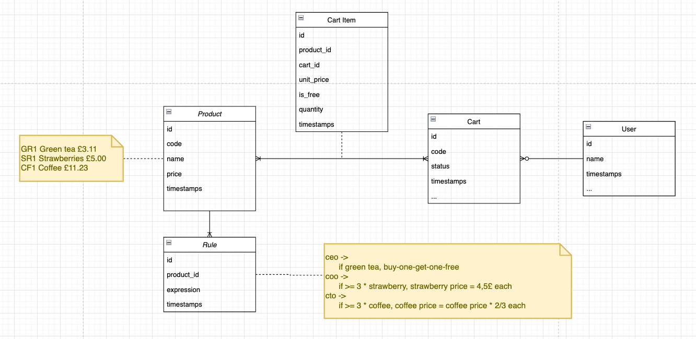

# Supermarket

## Installing Elixir and Erlang With ASDF

Please follow this [guide](https://www.pluralsight.com/guides/installing-elixir-erlang-with-asdf).

## Start

To start your Phoenix server, navigate until project root folder and:
  * Install dependencies with `mix deps.get`
  * Create and migrate your database with `mix ecto.setup`
    * Products and associated rules will be created
  * Start Phoenix endpoint with `mix phx.server` or inside IEx with `iex -S mix phx.server`

Now, you can visit [`localhost:4000/api/graphiql`](http://localhost:4000/api/graphiql) from your browser and
import the follow [json file](priv/static/supermarket.json) (where you can create and complete carts and compare with your test data).

# Test

To start all tests, navigate until project root folder and:
  * run `./mix_test.sh`
    * Please check (with special focus on) `test/supermarket_graphql/cart/mutation/cart_complete_test.exs`

# Database/Design

## Learn more

  * Official website: https://www.phoenixframework.org/
  * Guides: https://hexdocs.pm/phoenix/overview.html
  * Docs: https://hexdocs.pm/phoenix
  * Forum: https://elixirforum.com/c/phoenix-forum
  * Source: https://github.com/phoenixframework/phoenix
